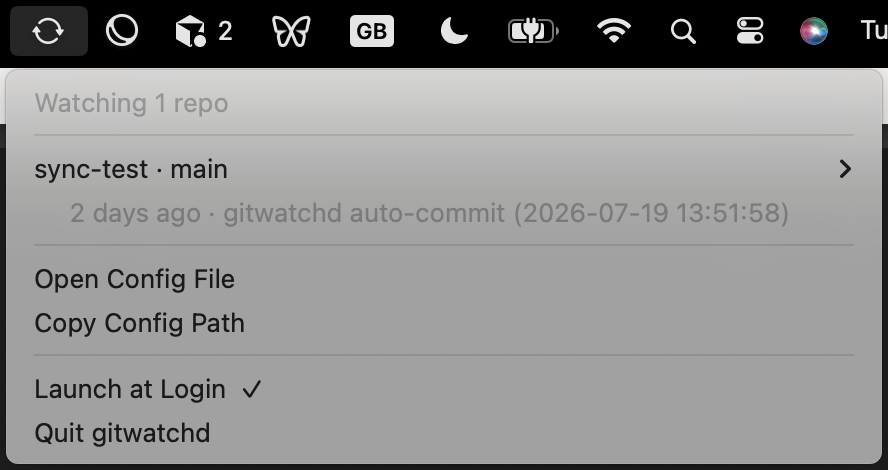

# gitwatchd

[](https://github.com/Will-Howard/gitwatchd/actions/workflows/test.yml)

MacOS daemon to watch a file or folder and automatically commit changes to a git repo. Behaviour matches the original [gitwatch](https://github.com/gitwatch/gitwatch) bash script, so you can use `gitwatchd` as a drop-in replacement.

## Usage

Watch a repo:

    gitwatchd .

Every change is now committed automatically (debounced, so a burst of writes lands as one commit). Add a remote to push each commit too:

    gitwatchd -r origin .

For something like a notes vault synced across machines, add `-R` pull and rebase before each push:

    gitwatchd -r origin -b main -R .

This is the full list of available flags:

    -s <secs>     wait this long after the last change before committing (default 2)
    -r <remote>   push to this remote after every commit
    -b <branch>   branch to push to (with -r)
    -R            pull --rebase before each push
    -m <msg>      commit message; %d becomes the timestamp
    -d <fmt>      strftime format for that timestamp
    -l <lines>    use the diff itself as the commit message, up to <lines> lines (0 = no limit)
    -L <lines>    same as -l without colour. Known bug: on git versions > 2.39 this falls back to a status summary
    -c <command>  run this command and use its output as the commit message (overrides -m/-d)
    -C            pipe the changed file names into the -c command (requires -c flag, e.g. `gitwatchd -c 'xargs echo updated:' -C .`)
    -x <pattern>  skip changes whose path matches this regex
    -M            don't commit while a merge is in progress
    -f            commit anything already pending when watching starts
    -g <path>     location of the .git directory, if elsewhere

gitwatchd runs as an app in the top bar (this is the ~only legit way to have an always-running app on MacOS). You can manage what's being watched from there or from the terminal.



Terminal commands to manage what's being watched:

    gitwatchd status
    gitwatchd pause blog      # by name or path
    gitwatchd resume blog
    gitwatchd rm blog

The set of repos to watch is stored in `~/.gitwatchd`, you can also edit this file directly rather than using the terminal or top bar app.

## Installation

```
brew tap will-howard/tap
brew trust --cask will-howard/tap/gitwatchd
brew install --cask gitwatchd
```

Or download the zip from [releases](https://github.com/Will-Howard/gitwatchd/releases) and put gitwatchd.app in /Applications.

<!-- TODO add troubleshooting in future if people have problems with things like SSH keys -->

## Credit and license

gitwatchd is a daemon (i.e. running in the background) reimplementation of
[gitwatch](https://github.com/gitwatch/gitwatch) by Patrick Lehner and
contributors. Free software under the [GNU GPL v3.0](LICENSE), same as gitwatch.
